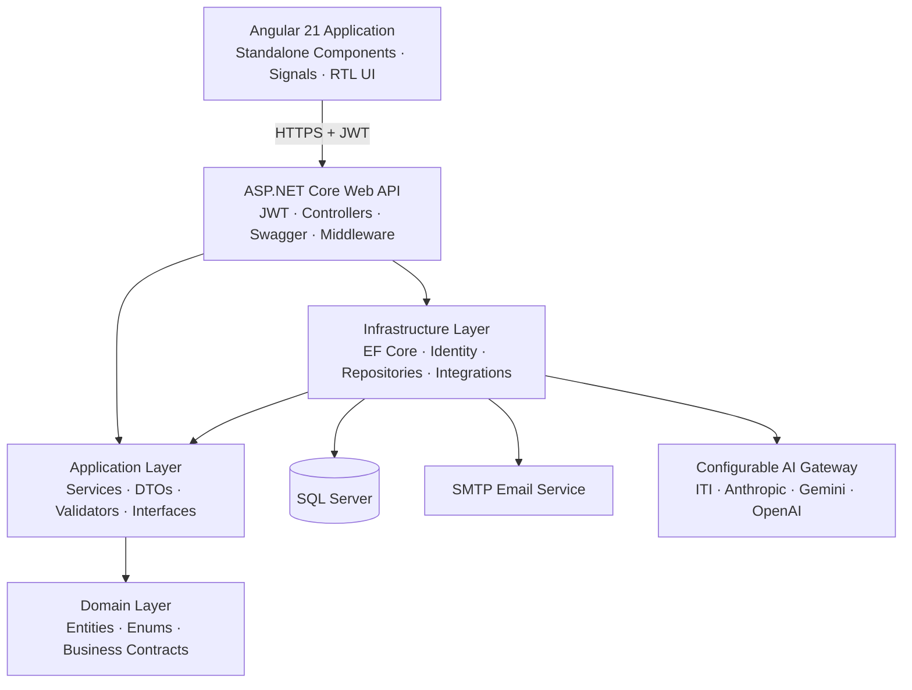

<div align="center">


# SmartInvest Platform

### Investment Planning, Procurement & Project Monitoring Platform

**منصة إدارة ومتابعة مشروعات الخطة الاستثمارية لمحافظة المنوفية**


</div>

---

## Overview

**SmartInvest** is a full-stack platform designed to digitize the investment development plan workflow for **Menoufia Governorate**.

It provides one integrated system for:

- Investment plan preparation.
- Main and sub-project management.
- Financial-year budgeting.
- Bank funding availability tracking.
- Project approval.
- Procurement and contracting.
- Official document versioning.
- Contractor and executive-agency management.
- Execution-stage monitoring.
- Financial and physical progress tracking.
- Management dashboards and decision-support indicators.

The platform follows projects from their initial proposal through approval, procurement, contract award, site handover, execution, and final delivery.

> [!IMPORTANT]
> SmartInvest is an active development build. Its major business modules are implemented, but production security hardening, automated testing, deployment automation, and infrastructure configuration are still in progress.

---

## Table of Contents

- [Business Workflow](#business-workflow)
- [Implemented Modules](#implemented-modules)
- [User Roles and Permissions](#user-roles-and-permissions)
- [Project Management](#project-management)
- [Excel Import and AI Assistance](#excel-import-and-ai-assistance)
- [Investment Plans](#investment-plans)
- [Financial Years and Bank Availabilities](#financial-years-and-bank-availabilities)
- [Procurement and Contracting](#procurement-and-contracting)
- [Presentation Memos](#presentation-memos)
- [Project Execution and Follow-up](#project-execution-and-follow-up)
- [Dashboard and Analytics](#dashboard-and-analytics)
- [Contractors and Executive Agencies](#contractors-and-executive-agencies)
- [Settings and Lookup Management](#settings-and-lookup-management)
- [User Accounts and Profiles](#user-accounts-and-profiles)
- [Responsive Arabic UI](#responsive-arabic-ui)
- [Architecture](#architecture)
- [Technology Stack](#technology-stack)
- [Repository Structure](#repository-structure)
- [Local Setup](#local-setup)
- [Configuration](#configuration)
- [API Documentation](#api-documentation)
- [Security Notes](#security-notes)
- [Current Boundaries](#current-boundaries)
- [Roadmap](#roadmap)
- [Project Team](#project-team)

---

## Business Workflow

```mermaid
flowchart LR
    A["Manual Entry or Excel Import"] --> B["Suggested Investment Plan"]
    B --> C["Project Review and Approval"]
    C --> D["Approved Investment Plan"]
    D --> E["Procurement Workflow"]
    E --> F["Contract Award"]
    F --> G["Site Handover"]
    G --> H["Execution Stages"]
    H --> I["Final Delivery"]
    I --> J["Dashboard and Performance Monitoring"]
```



SmartInvest connects planning, financial control, procurement, and execution monitoring without requiring separate disconnected spreadsheets for every stage.

---

## Implemented Modules

| Module | Status | Highlights |
|---|---:|---|
| Authentication and RBAC | ✅ Implemented | JWT, three application roles, protected routes |
| User profiles | ✅ Implemented | Personal details, avatars, password management |
| Password recovery | ✅ Implemented | Secure email reset links through SMTP |
| User management | ✅ Implemented | Create, edit, activate, deactivate, reset passwords |
| Project management | ✅ Implemented | Main/sub-project hierarchy, CRUD, search and filters |
| Project approval | ✅ Implemented | Manager approval, project codes, stalled/reactivated states |
| Financial years | ✅ Implemented | Budgets, open/closed status, safe deletion rules |
| Bank availabilities | ✅ Implemented | Evidence-based availability ledger with CRUD |
| Excel import | ✅ Implemented | Suggested/approved plan detection and reconciliation |
| AI-assisted extraction | ✅ Implemented | Measurements, project nature, headers and lookup suggestions |
| Investment plans | ✅ Implemented | Suggested/approved archive and printing |
| Procurement | ✅ Implemented | Six sequential stages with versioned documents |
| Presentation memos | ✅ Implemented | Multi-project memos and legal-affairs evidence |
| Contractors | ✅ Implemented | Profiles, assignments, fines, notes and evaluation |
| Executive agencies | ✅ Implemented | Profiles and assigned-project tracking |
| Project follow-up | ✅ Implemented | Financial/physical progress, deadlines and penalties |
| Dashboard | ✅ Implemented | KPIs, drill-down cards and eight chart types |
| Settings | ✅ Implemented | Lookup, measurement and organizational-data management |
| Responsive UI | ✅ Implemented | Desktop, tablet and mobile layouts |
| Production hardening | ⚠️ In progress | Testing, CI/CD, secret rotation and deployment |

---

## User Roles and Permissions

SmartInvest is an internally managed system. It does not provide public self-registration.

### Roles

| Role | Main Responsibilities |
|---|---|
| `SuperAdmin` | Full platform access, management of employees and planning managers |
| `PlanningManager` | Project and plan approval, dashboard access, employee management, sensitive operations |
| `PlanningEmployee` | Day-to-day project entry, imports, documentation, procurement and follow-up work |

### Permission Highlights

- Only a **Super Admin** can create or promote another Planning Manager.
- Planning Managers can manage Planning Employee accounts.
- Super Admin accounts cannot be modified from the normal user-management screen.
- Project approval, project reactivation, penalties, sensitive deletion, and workflow reopening are manager-controlled.
- Operational users can prepare data and upload documents without receiving unrestricted administrative access.
- Backend authorization policies and frontend route guards work together to protect restricted areas.

---

## Project Management

The project hierarchy is:

```text
Main Program
└── Sub Program
    └── Main Project
        └── Sub Project
```

### Main Projects

- Create and edit main projects.
- Assign projects to main and sub-programs.
- Store optional project codes.
- Display the number of contained sub-projects.
- Aggregate bank funding, self-funding, and total funding.
- Expand project rows to browse their sub-projects.
- Manager-controlled approval and deletion.
- Searchable and paginated project lists.

### Sub-Projects

Each sub-project can include:

- Main project and program hierarchy.
- Project code and approval state.
- Project level.
- Physical component type.
- Accounting unit.
- Project nature: supplies or contracting.
- Markaz and governorate.
- Priority and current status.
- Executive agency.
- Bank funding.
- Self-funding.
- Total estimated cost.
- Permitted budget-overrun percentage.
- Description and project goal.
- Social impact.
- Economic impact.
- Environmental impact.
- Green-investment reference.
- Geographic coordinates.
- Multiple financial years.
- Custom measurements.
- Contractor and contract information.

### Project Operations

- Create and edit sub-projects.
- Add a sub-project to an existing main project.
- Create a main project and its first sub-project in one workflow.
- Link one project to multiple financial years.
- Approve main and sub-projects using unique project codes.
- Mark approved projects as stalled with a required reason.
- Reactivate stalled projects.
- Assign or change the executive agency.
- Search by project name or code.
- Filter by:
  - Approval status.
  - Stalled status.
  - Main program.
  - Sub-program.
  - Project level.
  - Executive agency.
  - Markaz.
  - Priority.
  - Funding type.
  - Financial year.
- Paginate large project lists.

### Financial Value Convention

Planning-related financial inputs are entered in **thousands of Egyptian pounds**.

For example:

```text
Entered value: 500
Stored value: 500,000 EGP
Displayed planning value: 500 thousand EGP
```

This convention is applied to project funding, financial-year budgets, bank availabilities, and planning/dashboard indicators while preserving full EGP values in the backend.

---

## Project Details

Every sub-project has a dedicated details page with four main tabs.

### 1. Basic Data

- Project and program hierarchy.
- Project classification.
- Location and organizational information.
- Status, priority, and approval state.
- Bank, self, and total funding.
- Linked financial years.
- Contractor and contract details.
- Project description.
- Goal and expected impacts.
- Green-investment link.

### 2. Measurements

- Add project-specific measurement values.
- Edit or remove recorded measurements.
- Select measurement name, value, and unit.
- Use only measurements applicable to the project’s sub-program.
- Display records in responsive tables/cards.

### 3. Geographic Location

- Interactive map powered by **Leaflet** and **OpenStreetMap**.
- Map centered around Menoufia.
- Click on the map to place a project marker.
- Drag the marker to correct the location.
- Save latitude and longitude.
- Display existing saved coordinates.

### 4. Procurement Summary

- Procurement-stage progress.
- Related presentation memos.
- Direct navigation to the full financial-management workflow.

---

## Excel Import and AI Assistance

SmartInvest provides a multi-step Excel import wizard for government investment-plan sheets.

### Excel Parsing

The backend uses **ClosedXML** to parse `.xlsx` workbooks.

Import rules include:

- `.xlsx` format only.
- Maximum upload size of 10 MB.
- One project-data worksheet per file.
- Arabic header recognition.
- Diacritic-insensitive header matching.
- Automatic header-row discovery.
- Validation of required planning columns.
- Empty data rows are ignored.
- Funding values in the sheet are treated as thousands and converted to full EGP.

### Automatic Plan-Type Detection

SmartInvest detects the type of the uploaded plan from project codes:

- No sub-project codes → **Suggested Plan**.
- Every sub-project has a code → **Approved Plan**.
- A mixture of coded and uncoded rows is rejected to prevent inconsistent imports.

### Four-Step Import Wizard

1. **Upload**
   - Select the financial year.
   - Upload the Excel workbook.
   - Send the workbook for a safe preview.

2. **Reconciliation**
   - Review unknown lookup values.
   - Link names to existing records.
   - Create missing lookup records.
   - Resolve main-project code conflicts.
   - Match approved rows with existing proposed projects.
   - Choose whether unresolved rows should create new projects.

3. **Confirmation**
   - Review creation and approval counts.
   - Enter the approval date for approved plans.
   - Review extracted measurements.
   - Add, edit, or delete measurements before import.

4. **Result**
   - Show projects created.
   - Show projects approved.
   - Show projects linked to the financial year.
   - Report failed rows individually with their reasons.
   - Display the generated plan and its final status.

### AI-Assisted Import

AI is used specifically to improve Excel import quality.

Implemented AI tasks include:

- Recovering slightly incorrect Arabic column headers.
- Suggesting matches for misspelled or differently formatted lookup names.
- Matching approved-plan rows with existing proposed projects.
- Extracting measurable quantities from Arabic project names.
- Normalizing measurement units.
- Classifying project nature as:
  - `توريدات`
  - `مقاولات`

AI suggestions are never applied blindly. They are presented to the planning employee for review and confirmation.

### Supported AI Providers

The AI gateway can be configured for:

- ITI student gateway.
- Anthropic.
- Google Gemini.
- OpenAI.

The provider, model, API key, and optional base URL can be changed through configuration without modifying the import business logic.

> [!NOTE]
> If the AI provider is unavailable, import assistance falls back to a degraded/manual mode instead of discarding the entire import operation.

> [!IMPORTANT]
> SmartInvest does not currently implement RAG or multi-agent orchestration. The implemented AI scope is focused on Excel-import assistance.

---

## Investment Plans

SmartInvest maintains an archive of investment plans by financial year.

### Plan Types

- Suggested plans.
- Approved plans.

### Features

- Filter plans by financial year.
- Filter by suggested or approved status.
- Display plans as responsive cards.
- Generate a suggested plan from financial-year projects.
- Generate an approved plan from approved projects.
- Record suggestion and approval dates.
- Prevent duplicate suggested plans for the same financial year.
- Add new or existing projects to a plan through the backend.
- Remove projects from a plan.
- Approve plans through manager-controlled operations.
- Open a dedicated printable plan page.
- Show plan totals and project rows.
- Print or save the plan as PDF using the browser print dialog.

---

## Financial Years and Bank Availabilities

### Financial Years

A financial year contains:

- Name.
- Start date.
- End date.
- Budget.
- Open or closed status.

Supported operations:

- Create financial years.
- Automatically prepare the next financial-year period.
- Edit dates and budget.
- Open or close a financial year.
- Delete an unused financial year with confirmation.
- Link and unlink projects across financial years.

Deletion is blocked if the financial year is referenced by:

- Sub-projects.
- Investment plans.
- Bank availability records.

Database migrations are not applied automatically at application startup and must be run explicitly.

### Bank Availability Ledger

Bank availability represents money formally released by the bank and made available for project spending.

For each financial year, the system displays:

- Total bank funding.
- Total amount made available.
- Remaining amount that may still be released.
- Availability rate compared with bank funding.

Each availability record includes:

- Amount.
- Receipt date.
- System registration date.
- Notes.
- Official proof documents.

Supported operations:

- Add an availability.
- Edit its amount, receipt date, notes, and documents.
- Preserve or remove existing proof documents during editing.
- Delete an availability through a manager-controlled action.
- Download all stored evidence documents.
- Browse the complete availability history.

### Availability Business Rules

- The financial year must be open.
- Amount must be greater than zero.
- Receipt date must be within the selected financial year.
- Receipt date cannot be in the future.
- At least one proof document is required.
- Maximum of five documents per availability.
- Maximum file size is 10 MB per document.
- Supported formats:
  - PDF.
  - PNG, JPG and JPEG.
  - DOC and DOCX.
  - XLS and XLSX.
- Total availabilities cannot exceed the total bank funding of projects linked to the year.
- Serializable database transactions prevent concurrent operations from exceeding the bank-funding ceiling.

---

## Procurement and Contracting

SmartInvest implements a complete six-stage procurement workflow for each sub-project.

```text
1. Tender Document
2. Announcement
3. Opening Envelopes
4. Technical Evaluation
5. Financial Evaluation
6. Contract Award
```

Arabic workflow labels:

```text
كراسة الشروط
الإعلان
فتح المظاريف
التقييم الفني
التقييم المالي
العقد والترسية
```

### Sequential Workflow

- Stages are completed in order.
- A later stage remains locked until the previous stage is completed.
- Planning staff can upload document versions and complete stages.
- Managers can reopen completed stages.
- Reopening a stage resets the completion state of later stages where required.
- Required documents are validated before stage completion.

### Versioned Document Management

Each procurement stage supports:

- One or more required document slots.
- Drag-and-drop uploads.
- Optional notes.
- Automatic version numbering.
- File metadata and size display.
- Authenticated document downloads.
- Historical versions that remain available for reference.
- Read-only history after stage completion.

### Stage Documents

Examples include:

- Tender document.
- Newspaper announcement.
- Procurement portal announcement.
- Competent-authority approval.
- Opening-envelopes minutes.
- Technical committee reports.
- Final technical-evaluation report.
- Financial-envelope opening minutes.
- Financial-evaluation report.
- Estimated-cost sheet.
- Award order.
- Contract.
- Advance-payment proof.

### Contract Award

The final procurement stage records:

- Selected contractor.
- Contractor history summary.
- Contract type.
- Contract number.
- Contract value.
- Execution duration in months and days.
- Project funding structure.
- Advance-payment percentage.
- Advance-payment split between bank and self-funding.
- Confirmation that the advance payment was actually paid.
- Advance-payment proof.
- Penalty amount.
- Site-handover mode.
- Site-handover date and proof.
- Calculated contractual delivery date.

Contracting projects can use advance payments, while supply projects follow their own spending rules.

Completing contract award automatically prepares the execution-follow-up lifecycle.

---

## Presentation Memos

Presentation memos can cover one or multiple sub-projects.

Features include:

- Create a presentation memo.
- Edit its title and linked projects.
- Search by memo title, project name, or project code.
- Filter by financial year and status.
- Link one memo to multiple projects.
- Upload multiple versions.
- Store notes for every version.
- Upload a legal-affairs committee decision.
- Display version date, number, files, sizes, and decision state.
- Complete a memo after its required evidence is available.
- Reopen a completed memo through manager permissions.
- Delete a memo before official version history exists.
- Download stored memo and legal-decision files.

Official version history is preserved to provide a reliable document trail.

---

## Project Execution and Follow-up

After contract award, projects move into execution monitoring.

### Follow-up Portfolio

The follow-up page provides:

- Financial-year selection.
- Total approved projects.
- Stalled-project count.
- Overdue-stage count.
- Search by project name or code.
- Assigned contractor.
- Financial progress percentage.
- Physical progress percentage.
- Nearest execution deadline.
- Deadline warnings.

### Execution Stages

Users can record:

- Stage name.
- Stage deadline.
- Self-funding spent.
- Bank funding spent.
- Physical progress percentage.
- Self-funding payment proof.
- Bank-funding payment proof.
- Physical-progress proof.
- Notes.

### Execution Rules

- Execution stages cannot start before contract award is completed.
- Spending values cannot be negative.
- Physical progress must be between 0% and 100%.
- Proof is required when a spending or progress value is recorded.
- Supply projects must record physical progress before spending on the same stage.
- Total spending cannot exceed:
  - Project total cost.
  - Plus any configured overrun percentage.
- Deadlines that exceed the contractual delivery date are clearly flagged.

### Completion and Penalties

- Complete an execution stage.
- Reopen it through manager permissions.
- Add a penalty amount.
- Mark a penalty as paid or unpaid.
- Download all execution evidence.
- Preserve stage notes and history.

### Site Handover and Final Delivery

- Record or correct the site-handover date.
- Require site-handover proof.
- Calculate contractual delivery from handover date and execution duration.
- Automatically create and maintain the final-delivery stage.
- Recalculate final delivery when site-handover information changes.

---

## Dashboard and Analytics

The management dashboard is available to Planning Managers and Super Admins.

### Drill-Down KPIs

- Total projects.
- Approved projects.
- Proposed projects.
- Stalled projects.
- Approval rate.
- Total funding.
- Bank funding.
- Self-funding.
- Total bank availabilities.
- Availability rate.
- Total spending.
- Spending rate.
- Average physical progress.
- Projects currently in execution.

Dashboard KPI cards navigate to the related filtered project or follow-up pages.

### ECharts Visualizations

SmartInvest uses **Apache ECharts** to render responsive visualizations:

1. Bank vs self-funding distribution.
2. Bank-availability percentage gauge.
3. Project distribution by status.
4. Project distribution by priority.
5. Bank and self-funding by main program.
6. Cumulative bank-availability timeline.
7. Project distribution by Markaz.
8. Physical-progress range distribution.

The dashboard supports:

- Pie and donut charts.
- Rose charts.
- Bar and stacked-bar charts.
- Gauge charts.
- Line charts.
- Tooltips and legends.
- Empty-data states.
- Accessible chart descriptions.
- Automatic resizing through `ResizeObserver`.

### Operational Detail Panels

- Stalled projects.
- Overdue execution stages.
- Latest bank availabilities.
- Highest-funded projects.
- Projects waiting for approval.
- Most recently added projects.

Every item links to its relevant workflow.

---

## Contractors and Executive Agencies

### Contractor Profiles

Contractor records include:

- Contractor or company name.
- Company type.
- Category.
- National ID or commercial-register number.
- Phone number.
- Email address.
- Address.
- Active/inactive state.
- Assigned projects.
- Total penalties.
- Unpaid penalties.
- Rehiring assessment.
- General or project-specific notes.

Features include:

- Search and status filtering.
- Pagination.
- Create, edit, and delete.
- Expand a contractor to view assigned projects.
- Record whether the organization would work with the contractor again.
- Add dated notes.
- Show contractor history during contract award.

### Executive Agencies

Executive-agency records include:

- Agency name.
- Phone.
- Email.
- Address.
- Active/inactive state.
- Assigned sub-projects.

Features include:

- Search and status filters.
- Summary KPIs.
- Pagination.
- Create, edit, and delete.
- Expand agency rows to browse assigned projects.
- Referential protection when an agency is linked to active project data.

### Contract Types

- Create contract types.
- Edit contract types.
- Delete unused contract types.
- Prevent deletion when referenced by project assignments.

---

## Settings and Lookup Management

SmartInvest provides reusable settings pages for maintaining project reference data.

### Managed Lookup Catalogs

- Main programs.
- Sub-programs.
- Governorates.
- Markaz.
- Villages.
- Project priorities.
- Project statuses.
- Physical component types.
- Project levels.
- Accounting units.
- Contract types.
- Measurement units.

Supported features:

- Search.
- Create.
- Edit.
- Delete.
- Parent-child selection for hierarchical lookups.
- Duplicate-name protection.
- Referential deletion protection.
- Manager-only mutation controls.
- Responsive tables that become cards on mobile.

### Measurement Definitions

Measurement configuration supports:

- Measurement name.
- One or multiple measurement units.
- Association with multiple sub-programs.
- Grouping sub-programs under their main programs.
- Listing measurements applicable to a specific project.
- Preventing deletion of measurements or units already in use.

### Additional Settings Areas

- Financial years.
- Users.
- Contractors.
- Executive agencies.
- Measurements.

---

## User Accounts and Profiles

### Authentication

- Login using username or email.
- Password visibility toggle.
- Inactive-account rejection.
- JWT-based authentication.
- Automatic token attachment through the Angular HTTP interceptor.
- Automatic logout and redirection on unauthorized responses.
- Role-aware landing pages.
- Protected guest, authenticated, and role-based routes.

### User Management

Managers and Super Admins can:

- Create users.
- Edit permitted user data:
  - Full name.
  - Username.
  - Email.
  - Phone number.
  - Role.
- Search by name, username, or email.
- Filter active and inactive accounts.
- Reset a user’s password.
- Activate a user.
- Deactivate a user.
- Browse paginated user records.

Role restrictions are applied so Planning Managers manage employees while Super Admins can manage both employees and planning managers.

### Personal Profile

Every authenticated user has a personal profile containing:

- Full name.
- Username.
- Email.
- Phone number.
- Role.
- Account status.
- Account creation date.
- Profile avatar.

Users can:

- Edit their name, email, and phone.
- Upload an avatar.
- Replace an avatar.
- Delete an avatar.
- Change their current password.
- Request a password-reset link by email.

Avatar rules:

- PNG, JPEG/JPG, or WebP.
- Maximum size of 2 MB.

### Password Recovery

- Public forgot-password page.
- Token-based reset-password page.
- Reset links delivered through SMTP.
- Responsive RTL HTML email template.
- Generic success responses to reduce account enumeration.
- Unknown and inactive emails are handled silently.
- Email actions are rate-limited to five requests per IP every ten minutes.

> Email verification is not part of the current workflow. SMTP is used for password recovery.

---

## Responsive Arabic UI

SmartInvest is designed as an Arabic-first application.

### UI Characteristics

- Full RTL direction.
- Arabic document language.
- Cairo and Tajawal fonts.
- Menoufia Governorate visual identity.
- Green-and-gold design system.
- Reusable buttons, cards, forms, modals, badges, errors, and loading states.
- Collapsible desktop sidebar.
- Persistent sidebar preference.
- Off-canvas mobile navigation.
- Profile avatar in the navigation shell.
- Global toast notifications.
- Keyboard-accessible project rows and controls.
- Reduced-motion support.

### Mobile Behavior

At mobile widths:

- Dashboard KPI cards use 100% width.
- Chart cards become a single-column layout.
- Project cards use full width.
- Financial-year selectors use full width.
- Search boxes and filters use full width.
- Primary page buttons use full width.
- Modal actions stack vertically.
- Long titles and values wrap safely.
- Tables across the platform transform into labeled cards.
- Table headers are hidden visually while cell labels remain available.
- Very narrow screens stack labels and values vertically.

Responsive-card behavior is used across:

- Projects.
- Project details.
- Plans.
- Financial management.
- Presentation memos.
- Follow-up.
- Users.
- Agencies.
- Contractors.
- Measurements.
- Financial years.
- Settings lookups.

---

## Architecture

SmartInvest uses an Onion-style backend architecture and a standalone Angular frontend.



### Backend Layers

#### `SmartInvest.Domain`

Contains:

- Entities.
- Enums.
- Role constants.
- Repository contracts.
- Stored-file value objects.
- Core domain relationships.

#### `SmartInvest.Application`

Contains:

- DTOs.
- Business services.
- Service interfaces.
- FluentValidation definitions.
- AutoMapper profiles.
- Import orchestration.
- Business exceptions.
- AI abstraction contracts.

#### `SmartInvest.Infrastructure`

Contains:

- `AppDbContext`.
- SQL Server configuration.
- EF Core migrations.
- ASP.NET Core Identity.
- Generic repositories.
- Unit of Work.
- Domain service implementations.
- ClosedXML parser.
- SMTP email service.
- AI gateway integrations.
- Document persistence.

#### `SmartInvest.API`

Contains:

- API controllers.
- Dependency composition.
- JWT configuration.
- CORS configuration.
- Rate limiting.
- Swagger/OpenAPI.
- Global exception middleware.
- Development data seeding.

### Frontend Architecture

The Angular application uses:

- Standalone components.
- Lazy-loaded routes.
- Signals and computed state.
- Angular Forms.
- Functional guards.
- Functional HTTP interceptor.
- Shared design-system CSS.
- Feature-specific services and models.
- Role-aware navigation.
- Responsive page components.

---

## Technology Stack

| Layer | Technologies |
|---|---|
| Frontend | Angular 21, TypeScript 5.9, Angular Router, Angular Forms |
| State | Angular Signals and computed state |
| Charts | Apache ECharts 5 |
| Maps | Leaflet 1.9 with OpenStreetMap |
| Backend | ASP.NET Core Web API, C# 14, .NET 10 |
| Architecture | Onion-style layered architecture |
| ORM | Entity Framework Core 10 |
| Database | Microsoft SQL Server |
| Authentication | ASP.NET Core Identity, JWT Bearer |
| Authorization | Role-based API policies and Angular route guards |
| Validation | FluentValidation definitions and service-level business rules |
| Excel | ClosedXML |
| Mapping | AutoMapper |
| Email | SMTP with HTML templates |
| API Docs | Swagger / OpenAPI |
| Testing Tools | Vitest / Angular unit-test runner |
| Package Management | NuGet and npm |

---

## Repository Structure

```text
SmartInvest-Platform/
├── Backend/
│   ├── SmartInvest.slnx
│   └── src/
│       ├── SmartInvest.Domain/
│       │   ├── Common/
│       │   ├── Entities/
│       │   ├── Enums/
│       │   └── Interfaces/
│       ├── SmartInvest.Application/
│       │   ├── Common/
│       │   ├── DTOs/
│       │   ├── Interfaces/
│       │   ├── Services/
│       │   └── Validators/
│       ├── SmartInvest.Infrastructure/
│       │   ├── Data/
│       │   ├── Identity/
│       │   ├── Migrations/
│       │   ├── Repositories/
│       │   └── Services/
│       └── SmartInvest.API/
│           ├── Common/
│           ├── Controllers/
│           ├── Middleware/
│           ├── Properties/
│           └── Program.cs
├── Frontend/
│   ├── public/
│   └── src/
│       ├── app/
│       │   ├── core/
│       │   │   ├── guards/
│       │   │   ├── interceptors/
│       │   │   ├── models/
│       │   │   ├── services/
│       │   │   └── utils/
│       │   ├── features/
│       │   │   ├── auth/
│       │   │   ├── dashboard/
│       │   │   ├── projects/
│       │   │   ├── plans/
│       │   │   ├── financial/
│       │   │   ├── follow-up/
│       │   │   ├── profile/
│       │   │   ├── users/
│       │   │   ├── agencies/
│       │   │   ├── contractors/
│       │   │   ├── measurements/
│       │   │   └── settings/
│       │   ├── layout/
│       │   └── shared/
│       └── environments/
├── docs/
├── assets/
├── README.md
└── .gitignore
```

---

## Local Setup

### Prerequisites

Install:

- [.NET 10 SDK](https://dotnet.microsoft.com/download)
- A supported Node.js version:
  - Node.js `20.19+`
  - Node.js `22.12+`
  - Node.js `24+`
- npm
- Microsoft SQL Server
- EF Core CLI tools
- Git

Trust the ASP.NET Core development certificate:

```bash
dotnet dev-certs https --trust
```

### 1. Clone the Repository

```bash
git clone https://github.com/ahmedshalaby03/SmartInvest-Platform.git
cd SmartInvest-Platform
```

### 2. Restore the Backend

```bash
dotnet restore Backend/SmartInvest.slnx
```

If `dotnet-ef` is not installed:

```bash
dotnet tool install --global dotnet-ef --version 10.*
```

### 3. Configure Local Settings

Create:

```text
Backend/src/SmartInvest.API/appsettings.Local.json
```

This file is loaded after `appsettings.json` and is ignored by Git.

Example:

```json
{
  "ConnectionStrings": {
    "DefaultConnection": "Server=.;Database=SmartInvestDB;Trusted_Connection=True;TrustServerCertificate=True;MultipleActiveResultSets=True"
  },
  "Jwt": {
    "Key": "REPLACE_WITH_A_LONG_RANDOM_SECRET",
    "Issuer": "SmartInvest.API",
    "Audience": "SmartInvest.Client",
    "DurationInMinutes": 120
  },
  "Cors": {
    "AllowedOrigins": [
      "http://localhost:4200"
    ]
  },
  "Email": {
    "SmtpHost": "smtp.gmail.com",
    "SmtpPort": 587,
    "UserName": "your-notifications-account@gmail.com",
    "Password": "YOUR_GMAIL_APP_PASSWORD",
    "FromAddress": "your-notifications-account@gmail.com",
    "FromName": "Smart Invest",
    "EnableSsl": true,
    "FrontendBaseUrl": "http://localhost:4200"
  },
  "AiGateway": {
    "Provider": "OpenAi",
    "BaseUrl": "",
    "ModelId": "YOUR_MODEL_ID",
    "ApiKey": "YOUR_API_KEY"
  }
}
```

Never commit this file or any real credentials.

### 4. Apply Database Migrations

From the repository root:

```bash
dotnet ef database update \
  --project Backend/src/SmartInvest.Infrastructure/SmartInvest.Infrastructure.csproj \
  --startup-project Backend/src/SmartInvest.API/SmartInvest.API.csproj
```

On PowerShell, the same command can be written on one line:

```powershell
dotnet ef database update --project Backend/src/SmartInvest.Infrastructure/SmartInvest.Infrastructure.csproj --startup-project Backend/src/SmartInvest.API/SmartInvest.API.csproj
```

> Database migrations are not automatically applied by the API.

### 5. Run the Backend

```bash
dotnet run \
  --project Backend/src/SmartInvest.API/SmartInvest.API.csproj \
  --launch-profile https
```

Backend URLs:

```text
HTTPS:  https://localhost:7250
HTTP:   http://localhost:5187
Swagger: https://localhost:7250/swagger
```

### 6. Install and Run the Frontend

Open another terminal:

```bash
cd Frontend
npm ci
npm start
```

Frontend URL:

```text
http://localhost:4200
```

The frontend currently expects the API at:

```text
https://localhost:7250/api
```

### 7. Development Data

On startup, the API seeds:

- Application roles.
- Development administrator accounts.
- Menoufia geography data.
- Main programs.
- Sub-programs.
- Project priorities.
- Project statuses.

The bootstrap accounts and their development passwords are currently defined in:

```text
Backend/src/SmartInvest.API/Program.cs
```

They must be changed or removed before exposing the application outside a local development environment.

---

## Configuration

### Email

Password recovery requires SMTP configuration.

For Gmail:

1. Enable two-step verification on the sender account.
2. Create a Google App Password.
3. Place the App Password in `Email.Password`.
4. Do not use the normal Gmail account password.
5. Keep the configuration inside `appsettings.Local.json`, user secrets, or environment variables.

### AI Gateway

Supported values for `AiGateway.Provider`:

```text
Iti
Anthropic
Gemini
OpenAi
```

Required configuration:

- Provider.
- Model ID.
- API key.
- Base URL when using ITI or a custom proxy.

For official providers, `BaseUrl` can normally remain empty so the built-in endpoint is used.

### CORS

The default allowed frontend origin is:

```text
http://localhost:4200
```

If the Angular application runs on another domain or port, update `Cors.AllowedOrigins`.

---

## API Documentation

Swagger is enabled in the Development environment:

```text
https://localhost:7250/swagger
```

JWT-protected endpoints can be tested using Swagger’s **Authorize** button.

### Main API Areas

| Route | Responsibility |
|---|---|
| `/api/auth` | Login, profile, avatar, passwords and recovery |
| `/api/users` | User administration |
| `/api/dashboard` | Management dashboard |
| `/api/mainprojects` | Main-project management |
| `/api/subprojects` | Sub-project management and approval |
| `/api/subprojects/import` | Excel preview and commit |
| `/api/plans` | Suggested and approved plans |
| `/api/financial-years` | Financial-year management |
| `/api/financial-years/{id}/bank-availabilities` | Bank availability ledger |
| `/api/procurement/subprojects` | Procurement portfolio |
| `/api/subprojects/{id}/procurement` | Six-stage procurement workflow |
| `/api/presentation-memos` | Presentation memo management |
| `/api/follow-up` | Project execution portfolio |
| `/api/subprojects/{id}/execution-stages` | Execution-stage management |
| `/api/measurements` | Measurement definitions |
| `/api/subprojects/{id}/measurement-values` | Project measurement values |
| `/api/lookups` | Reference-data catalogs |
| `/api/agencies` | Executive agencies |
| `/api/contractors` | Contractor profiles and evaluation |
| `/api/contract-types` | Contract types |
| `/api/audit-logs` | Audit-log query foundation |

---

## Build and Test Commands

### Backend Build

```bash
dotnet build Backend/SmartInvest.slnx
```

### Frontend Development Build

```bash
cd Frontend
npm run build
```

### Frontend Unit Tests

```bash
cd Frontend
npm test
```

> Automated test coverage is currently limited. The remaining Angular scaffold test should be updated to reflect the actual routed application, and backend test projects still need to be introduced.

---

## Security Notes

Implemented security measures include:

- ASP.NET Core Identity.
- Unique user emails.
- JWT issuer validation.
- JWT audience validation.
- JWT lifetime validation.
- JWT signing-key validation.
- Zero JWT clock skew.
- Role-based authorization.
- Frontend route guards.
- HTTPS redirection.
- Configurable CORS.
- Rate-limited password-recovery endpoints.
- Generic forgot-password responses.
- Centralized exception handling.
- Sanitized JSON error responses.
- Inactive-account protection.
- Authenticated document downloads.
- Local secret override files excluded from Git.

### Required Before Production

- Rotate the JWT signing secret currently present in tracked configuration.
- Remove or replace hard-coded bootstrap account passwords.
- Move all secrets to environment variables or a managed secret store.
- Review every API authorization policy.
- Apply consistent file type and size validation to every upload workflow.
- Add malware scanning for official document uploads.
- Add automated backend and frontend security tests.
- Add centralized logging and monitoring.
- Configure production CORS origins.
- Enforce secure deployment certificates.
- Review data-retention and backup policies.

---

## Current Boundaries

The following are not currently implemented as production features:

- RAG-based document search.
- Multi-agent AI orchestration.
- Power BI integration.
- Docker deployment.
- GitHub Actions CI/CD.
- Fully wired automatic field-level audit logging.
- Complete automated backend test coverage.
- End-to-end browser tests.
- A dedicated PDF-generation engine.
- General CSV/XLSX export of all system data.
- Public user registration.
- Email-address verification.

AI currently serves the Excel-import workflow only.

Investment-plan PDF output is generated through the browser’s print/save-as-PDF functionality.

---

## Roadmap

- [ ] Complete backend unit and integration tests.
- [ ] Replace the remaining Angular scaffold test.
- [ ] Add end-to-end workflow tests.
- [ ] Complete authorization and upload-security review.
- [ ] Move bootstrap credentials and JWT keys out of source control.
- [ ] Add Docker and environment-based deployment.
- [ ] Add GitHub Actions for build, test and migration validation.
- [ ] Add production logging and monitoring.
- [ ] Wire automatic audit logging into critical operations.
- [ ] Add structured reporting and export options.
- [ ] Add backup and disaster-recovery procedures.
- [ ] Add production email and secret-management configuration.
- [ ] Add optional business-intelligence integration.
- [ ] Prepare production deployment documentation.

---

## Project Team

SmartInvest is developed by a team of six Full-Stack Developers:

- **Ahmed Saeed Shalaby** — Full-Stack Developer
- **Eslam Mohamed Kamel** — Full-Stack Developer
- **Osama Ayman** — Full-Stack Developer
- **Saleh Nagiub** — Full-Stack Developer
- **Abdelfattah Ahmed** — Full-Stack Developer
- **Marwa Gamal Elzanaty** — Full-Stack Developer

[](https://github.com/ahmedshalaby03)

---

## License

No open-source license has been declared for this repository yet.

Until a license is added, reuse, modification, and redistribution rights remain reserved by the project owners.

---

<div align="center">

### SmartInvest

**From investment planning to final project delivery — one connected platform.**

من التخطيط الاستثماري حتى التسليم النهائي للمشروع

</div>
